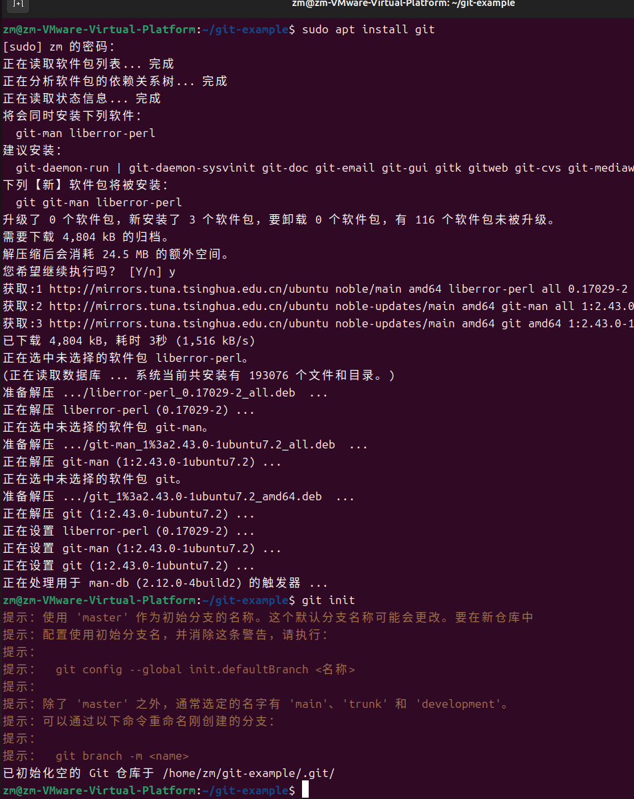
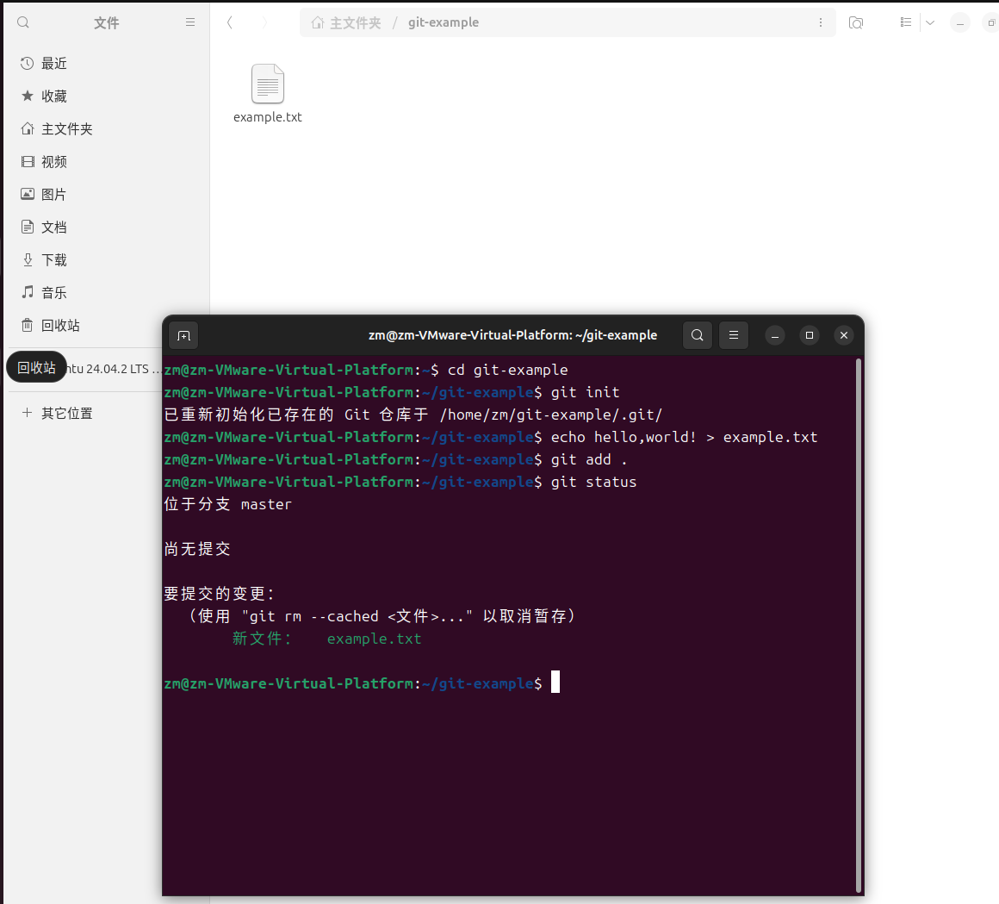
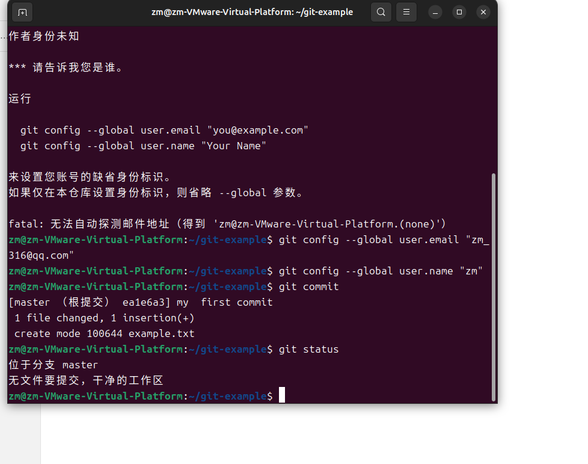
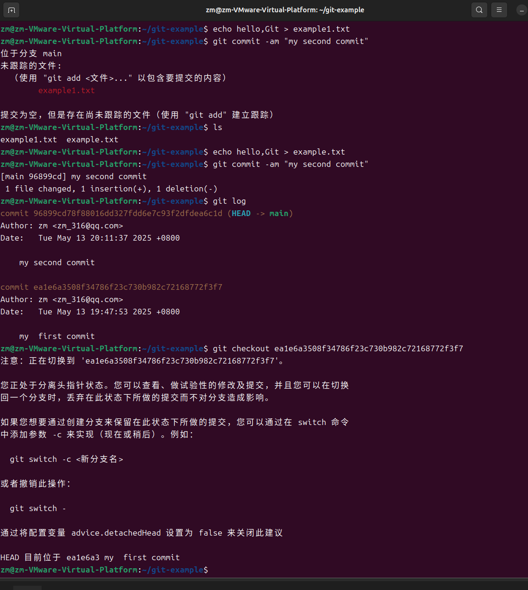
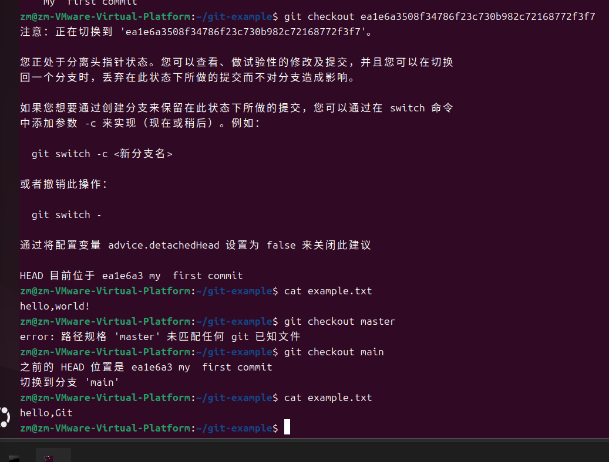
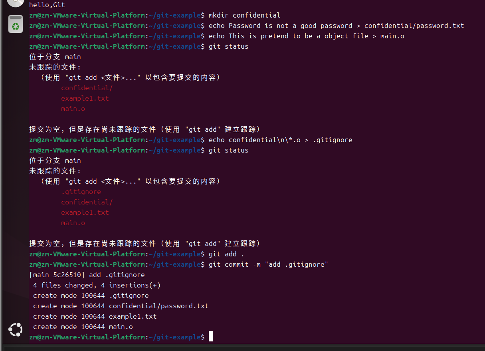
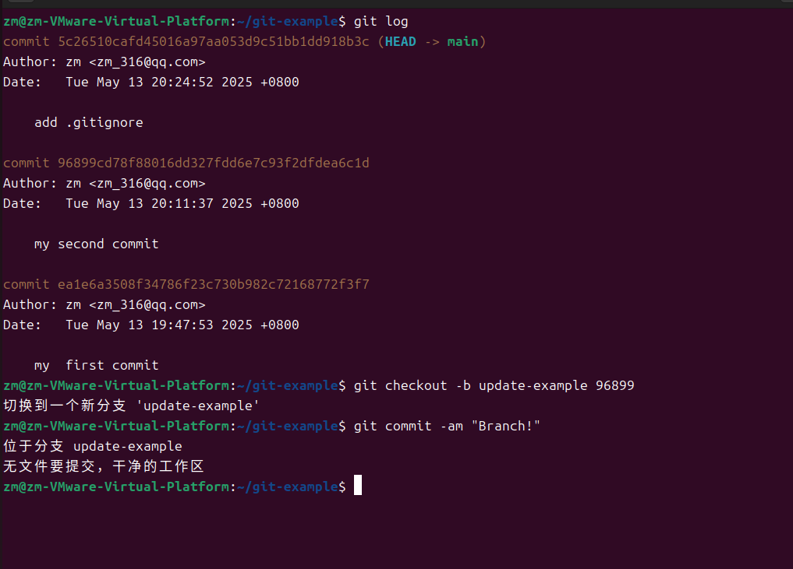
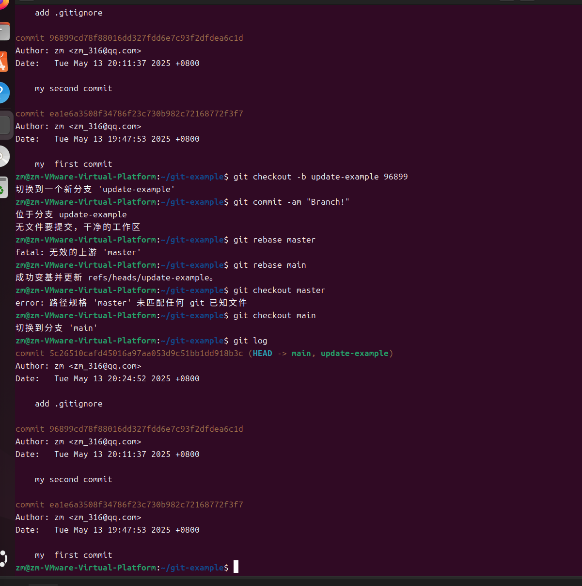
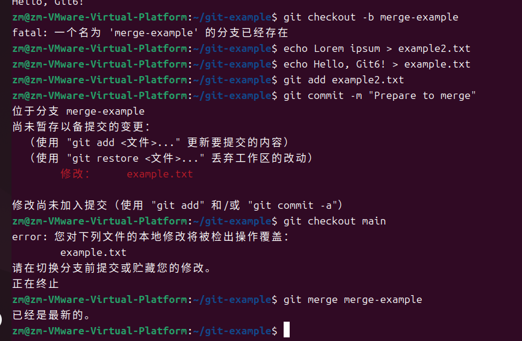

# Git 的使用#
## 初始化仓库 ##
```shell
mkdir git-example
cd git-example
git init
```

## 配置 Git ##
1. 对仓库进行一些配置，比如设置用户名和邮箱，设置代理等等。
2. 配置 Git 只需要用到 config 子命令。如果需要修改全局设置，可以加上 --global 参数，如果需要打开配置文件进行编辑，可以加上 --edit 参数。修改一下全局参数，执行
   ```git config --global --edit```
3. 暂存你的更改,使用 add 子命令可以暂存某一个文件的更改
``` shell 
echo Hello, world! > example1.txt  
git add . 
```
**git add**建立跟踪

4. 提交你的更改
使用 commit 子命令来提交你的更改。执行：
```shell
git commit
```



5. 排除掉特定的文件
   有时候一些文件不应该被版本管理系统追踪，如编译生成的目标文件，可执行文件，一些敏感配置等等。我们可以使用 .gitignore 文件来排除指定文件和文件夹。执行以下内容：
```shell
mkdir confidential
echo Password is not a good password > confidential/password.txt
echo This is pretend to be a object file > main.o
git status
```

# 分支管理#(branch)
1. 目前分支
```shell
git log
```

# 变基分支 #
```plain
A-----B-----C (master)
       \                  A-----B-----C-----D  (update_example)
        \            ===>         (master)
         D    (update-example)
```
将刚刚创建的提交变到主线上，如下图所示：

# 合并分支与冲突解决 #

# Git 服务器与多人合作 #
1. 克隆就是把别人的代码仓库复制一份过来
```shell
git clone url://path/to/be/cloned
```
2. 拉取代码
   有时候远端代码库已经更新，你需要更新本地代码，这时候用 pull 子命令。
```shell
git pull
```
3. 三种合并方式：
-合并(merge)：创建一个基于提出请求的分支和目标分支的合并提交（见前面合并分支部分的说明）  
-变基(rebase)：将提出请求的分支中的相关提交的修改内容依次应用到目标分支上    
-压缩(squash)：将提出请求的分支中的相关提交的修改内容作为一个提交应用到目标分支上      

 