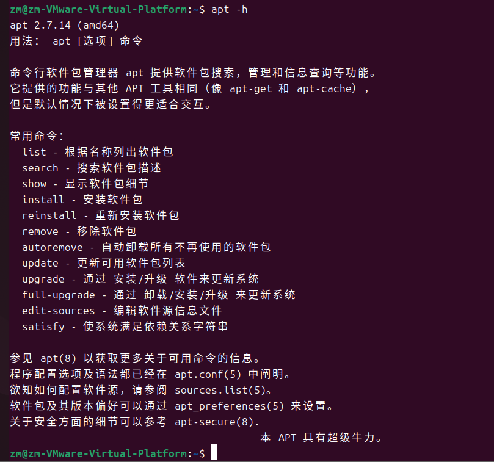

-小火车：
```bash
sudo apt update
sudo apt install -y sl
sl
```

(小火车)
-命令格式：程序 子命令 选项 对象
apt：
# Linux命令 #
1. cd:切换文件夹
2. ls：查看文件夹下面的内容
3. . :当前路径
4. .. :当前目录的父目录
5. ~ ：当前用户的家目录
6. 
*try*：
1. **/proc**:linux中的虚拟文件系统，提供访问内核数据和系统信息的接口。注意：/proc上的文件并不存在于磁盘上，而是由内核动态生成，用于反应系统运行时的状态。
   1. 特点：
   - 是虚拟文件系统，不占用磁盘空间，数据由内核实时生成。
   - 包含系统信息、进程状态、内核参数。
   2. /proc中的重要文件和目录： 
**系统信息**   
|文件/目录  |说明|  
|--------------------|-----|   
| `/proc/cpuinfo`   | **CPU 信息**（型号、核心数、频率等）。 |  
| `/proc/meminfo`   | **内存使用情况**（总内存、空闲内存、缓存等）。 |  
| `/proc/version`   | 内核版本及编译信息。 |  
| `/proc/uptime`    | 系统运行时间（以秒为单位）。 |  
| `/proc/loadavg`   | 系统负载（1、5、15 分钟的平均值）。 |  
| `/proc/filesystems` | 系统支持的文件系统类型。 |  
| `/proc/devices`   | 已加载的字符设备和块设备。 |  
| `/proc/partitions` | 磁盘分区信息。 |  
| `/proc/mounts`    | 当前挂载的文件系统。 |  
 **进程信息（按 PID 分类）**
每个正在运行的进程都有一个对应的目录 `/proc/[PID]/`，包含：  
| 文件/目录        | 说明 |  
|-------------------|------|  
| `/proc/[PID]/cmdline` | 启动该进程的命令行参数。 |  
| `/proc/[PID]/status` | 进程状态（内存、用户 ID、运行状态等）。 |  
| `/proc/[PID]/exe`   | 指向进程对应的可执行文件（符号链接）。 |  
| `/proc/[PID]/cwd`   | 指向进程的当前工作目录（符号链接）。 |  
| `/proc/[PID]/fd/`   | 该进程打开的文件描述符列表。 |  
| `/proc/[PID]/environ` | 进程的环境变量。 |  
 **内核与硬件信息**
| 文件/目录        | 说明 |  
|-------------------|------|  
| `/proc/interrupts` | 中断请求（IRQ）使用情况。 |   
| `/proc/ioports`   | I/O 端口占用情况。 |   
| `/proc/sys/`      | 内核参数（可通过 `sysctl` 修改）。 |  
2. **/dev**：（device）Linux 系统中的一个重要目录,存放代表系统的硬件设备（如硬盘、键盘、鼠标）或虚拟设备。
   1. /dev下的常见设备文件：
   **物理设备**
   |设备文件|说明|   
   |--------|----|      
   | `/dev/sda`       | 第一块 SATA/SCSI 硬盘（`sdb`, `sdc` 为第二、第三块）|       
| `/dev/nvme0n1`   | NVMe SSD 硬盘（如现代固态硬盘） |    
| `/dev/sda1`      | 第一块硬盘的第一个分区 |     
| `/dev/ttyS0`     | 串行端口（如 COM1） |    
| `/dev/ttyUSB0`   | USB 转串口设备 |    
| `/dev/input/mouse0` | 鼠标设备|    
| `/dev/dri/card0` | 显卡设备（用于图形显示） |    
**虚拟设备**
| 设备文件        | 说明 |  
|------------------|------|       
| `/dev/null`      | 黑洞设备，写入的数据会被丢弃，读取时返回 EOF |     
| `/dev/zero`      | 零数据源，读取时返回无限的空字节（`\x00`） |       
| `/dev/random`    | 随机数生成器（阻塞式，依赖系统熵池） |     
| `/dev/urandom`   | 非阻塞随机数生成器（速度更快，但安全性略低） |      
| `/dev/loop0`     | 回环设备，用于挂载镜像文件（如 ISO） |   
| `/dev/pts/0`     | 伪终端（SSH 或终端模拟器创建的会话） |    
**特殊设备**
| 设备文件       | 说明 |   
|------------------|------|    
| `/dev/stdin`     | 标准输入（文件描述符 `0`） |   
| `/dev/stdout`    | 标准输出（文件描述符 `1`） |  
| `/dev/stderr`    | 标准错误（文件描述符 `2`）|   
| `/dev/fd/0`      | 当前进程的文件描述符（如 `0`=stdin, `1`=stdout） |    
*answer*：/proc可以获取CPU的核心频率`/proc/cpuinfo`
3. scp 和 rsync 都是常用的文件传输工具，基于SSH加密传输
   ```bash
   scp [选项] 源文件 目标地址
   ```
   [选项包括]：    
   |选项|说明|    
   |-----|----|    
   |-P|指定SSH端口|   
   |-r|递归复制目录|   
   |-C|启用压缩传输|    
   |-v|显示详细传输日志|    
   ```bash
   rsync [选项] 源文件 目标地址
   ```
   [选项包括]：    
| 选项 | 说明 |   
|------|------|    
| `-a` | 归档模式（保留权限、时间等） |   
| `-v` | 显示详细传输日志 |    
| `-z` | 压缩传输 |     
| `-P` | 显示进度 + 断点续传 |    
| `-e` | 指定远程 Shell（如 `-e "ssh -p 2222"`） |   
| `--delete` | 删除目标端多余文件（严格同步） |    
