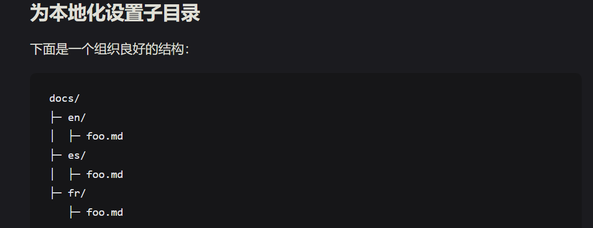

# 搜索和知识获取
## 知识的获取
### 搜索引擎的选取
**Google**
**微软 Bing 搜索**
### 信息平台
1. 官方文档
2. 很多 Linux 命令行工具带有丰富的 mandoc 文档，可以通过 man 命令查看（man 的用法可以通过 man man 查阅）
*试一试*

3. Stack Overflow:面向计算机程序员的问答网站
4. GitHub
5. Wikipedia
### CS自学指南
**CS61A**
### 提问
1. 礼貌且详细的进行问题描述
2. 向大模型LLM提问
   1.OpenAI
   2.Github Copilot
 