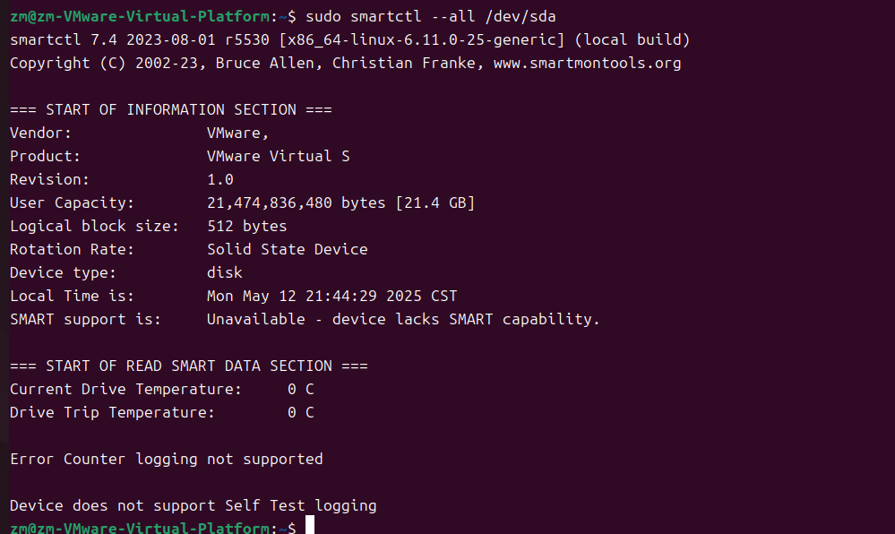
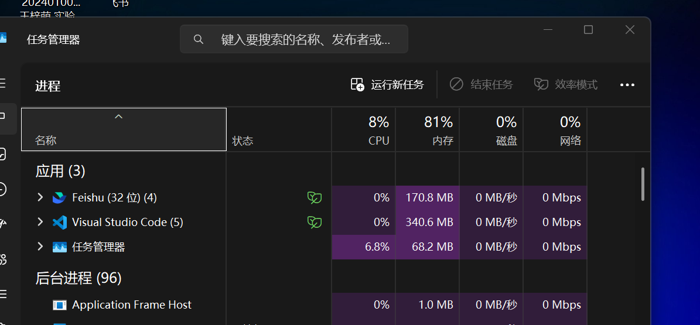
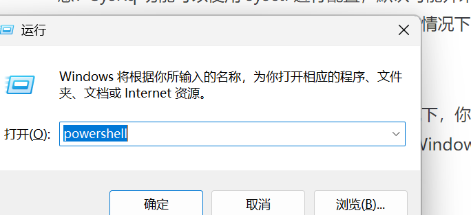

# 硬件资源监控 #
进行故障排除时，有时候我们需要检查硬件的信息，包括处理器占用情况，内存占用情况，磁盘占用情况等等。
## 磁盘信息 ##
1. 磁盘占用：文件管理器查看
2. 磁盘健康：Linux：smartctl 命令、Windows：CrystalDiskInfo 软件
   **在linux上的尝试**

## 处理器与内存信息 ##
Windows ：任务管理器
Linux：btop
## 电池信息 ##
Windows：powercfg命令
Linux：upower 命令+电池设备路径
# 常见故障自查 #
1. 蓝屏 
常见的蓝屏原因包括系统服务异常（多是驱动导致），关键进程退出（可能是病毒引起），机器检查（硬件故障）等。
2. 内核恐慌（linux为panic）
3. 应用软件崩溃
4. 系统启动慢：Windows：打开任务管理器禁止不必要的启动项；Linux：journalctl 检查日志
5. 应用程序慢：检查内存和处理器占用情况，网络连接，磁盘健康状态
6. 网络连接故障：对于 Linux 系统，可以检查 rfkill 是否允许相应网卡工作，ip 是否启动相应适配器。
# 快捷键 #
## 系统快捷键 ##
-Windows：
1. Ctrl+Alt+Del: 打开一个可以唤起任务管理器的屏幕
2. Ctrl+Shift+Esc: 直接打开任务管理器。

3. Alt+F4: 关闭处于焦点的窗口。如果没有窗口处于焦点，打开关闭计算机的对话框。
4. Alt+Tab: 切换窗口。
5. Win+Tab: 切换桌面。
6. Win+R: 打开运行窗口。
   
7. PrintScreen(PrtSc): 截图
-Linux shell
1. Ctrl+C: 发送 SIGINT 到前台进程组，默认行为是**程序退出**。
2. Ctrl+D: 关闭标准输入，或者说发送 EOF（文件末尾）。在 Windows Shell 中，一般为Ctrl+Z, Enter。
3. Ctrl+Z: 发送 SIGTSTP 到前台进程组，默认行为是程序退出，可用fg使程序恢复运行，或使用bg使程序在后台恢复运行，或者直接向程序发送 SIGCONT 恢复运行。
4. Ctrl+\: 发送 SIGQUIT 到前台进程组，和 SIGINT 不同的是，该信号默认不仅让程序退出，还会产生核心转储文件(coredump)。
5. Ctrl+Shift+C: 复制内容。
6. Ctrl+Shift+V: 粘贴内容。
7. Ctrl+A: 编辑命令时回到行首。
8. Ctrl+L: 清除屏幕，并重新打印当前行。
9. 

