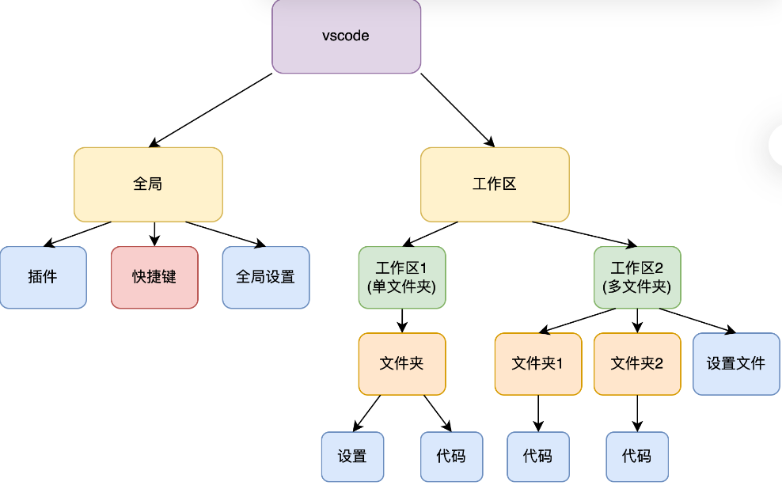
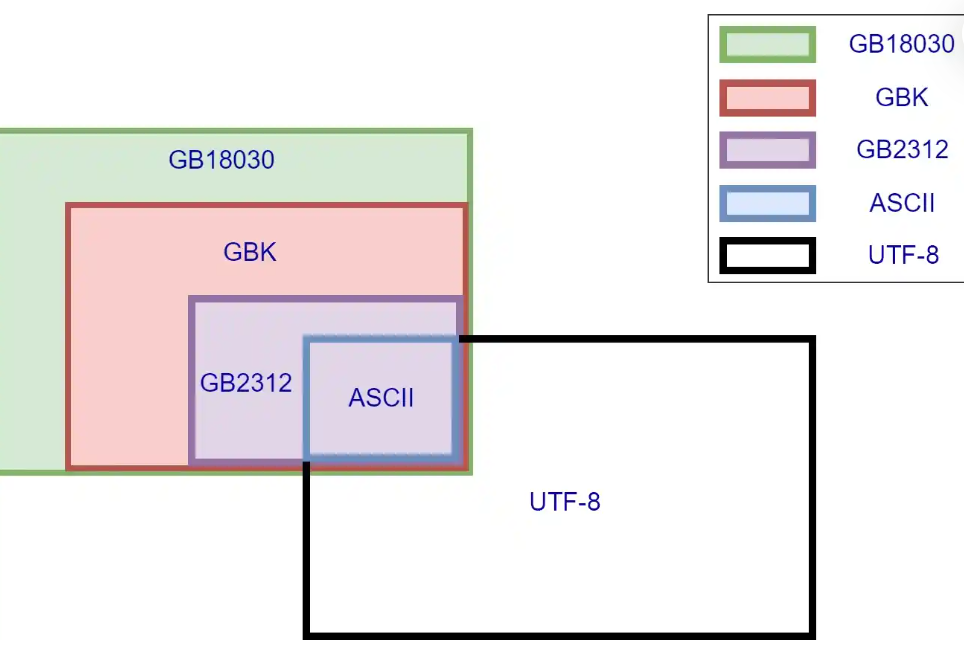

# 基本环境配置 #（VScode环境已经安装好了）
- 程序编写的过程
编辑vs编译：
“编辑”是我们常说的“敲代码”的过程，而“编译”是编译器将代码翻译成计算机能理解的二进制 01101010……（也就是常说的可执行文件，如 Windows 中的 .exe 文件）的过程，“编辑”发生在“编译”之前的。
- C++环境配置
1. GCC/MinGW
   -GCC（GNU Compiler Collection）是一类编译器集合。
   -MinGW 是一种编译器系统，建立在 GCC 和 binutils 项目上。
2. Clang/LLVM
   -Clang 是 C、C++、Objective-C 和 Objective-C++ 编程语言的编译器
   -Clang 基于 LLVM 实现
3. MSVC 和 Visual Studio
   MSVC（Microsoft Visual C/C++）是微软开发的一套 Windows 下的 C/C++编译器。Visual Studio 是微软的一款集成开发环境（IDE），其中包含了 MSVC 编译器。
4.  IDE：集成开发环境
5. 环境变量：环境变量是包含关于系统及当前登录用户的环境信息的字符串
6. 终端寻找程序位置：读取 **Path** 这个环境变量，从 Path 指示的路径中寻找
- VS Code工作逻辑
1. `vscode`分为全局和工作区两部分组成
 
2. 使用终端 PowerShell编译运行C++程序:
   1. 使用组合键 Ctrl+`打开终端（有些时候是 Ctrl+Shift+`）。这里使用 PowerShell。
   2. cd 到程序所在子目录（请自行查找 cd 命令用法）
   3. 使用 g++ 命令编译程序。如：g++ .\test.cpp（寻找文件时可以用 Tab 快捷键）。
   4. 上述命令默认生成 "a.exe"。请输入命令 .\a.exe 执行生成的 exe 文件。
 TRY:
- Windows 终端配置
  VS Code 中打开终端，或者按 Win+R 输入 powershell 回车。打开终端后，输入如下命令：
  `Set-ExecutionPolicy PolicyYouWant`
  PolicyYouWant为了兼顾安全性和易用性，我们建议使用 Remotesigned 策略。
  (管理员身份运行)
-常用快捷键和一些指令
**针对于终端**
1. Ctrl+Shift+C/V：终端中的复制和粘贴
2. Ctrl+C：请求终止程序并释放内存
3. Ctrl+Z：请求暂停程序，不释放内存，后续可以恢复执行
4. Ctrl+A：全选代码，方便快速复制提交。
5. 按住滚轮，上下滑动：扩展光标所在行数，可以批量在很多行代码前面加 Tab 或者删空格，便于控制缩进。
6. ./a.out < in > out：在 Linux 和 macOS 中，此指令可以从 in 读取输入，传递给程序 a.out 作为输入，然后把输出传到文件 out 中
7. get-content in | .\a.exe > out 这个命令功能与上述命令相同，但它在 Windows PowerShell 中使用。
8. cd：更改终端所在目录。使用时，输入 cd 后按 Tab 键，可以快捷遍历当前目录下的子目录。或者，也可以直接输入全路径。
# 文件和文本 #
1. 后缀：告诉计算机用哪一类应用程序来读取文件
2. 常见后缀：
   文本和文档：.txt、.doc、.docx、.xls、.xlsx、.ppt、.pptx
   源代码：C++：.cpp、.cc、.cxx、.hpp、.hxx
​          C：.h、.c 
​          Python：.py
3. 视频文件：.mp4、.avi、.mkv、.ts、.m3u8
4. 图片：.jpg/.jpeg、.png、.gif、.bmp、.webp、.svg
5. 压缩文件：.zip、.rar、.7z 等。常用于 Linux 系统的有：.tar.gz、.tar.xz
6. 可执行文件：Windows：.exe；Linux/Unix：无；MacOS：无，或 .app；Java 程序：.jar
7. 脚本文件：Windows：.bat、.cmd、.ps1；Linux/Unix：.sh
# 文件系统 #
  **文件路径**
1. 绝对路径：从根目录开始的完整路
2. 相对路径：相对于当前工作目录的路径
  **元数据**
  文件系统存储文件和目录的元数据，包括文件名、大小、创建时间、修改时间、权限等。
# 文本的编码 #
由编码出现问题所导致的运行出错：
保存文本文件和打开文本文件时，分别需要选择一种编码格式。如果这两种编码格式不匹配，打开时就可能显示乱码，例如常见的锟斤拷烫烫烫。**（打开文件的编码需要对保存文件的编码兼容）**

# 文件的创建 #
利用终端：首先定位到需要创建文件的目录（cd），之后输入命令：`touch filename`(filename是需要创建文件的名称)
# GitHub上软件的下载 #
首先：我们需要进入一个项目的 Releases 界面，在搜索引擎上搜索你要的软件名，后面加上 GitHub
然后找到它的 Assets 部分，找到对应的后缀
1. amd64（x64）架构：找到对应的架构，以及后缀为 .exe 或者 .msi 
2. Linux ：找到自己的架构，且后缀为 .deb、.tar.gz 等的文件
3. Intel 芯片，则要找 x64 架构，.dmg 后缀文件安装。
**注意安装时观察是否有捆绑软件**
-下载器推荐
Windows：Internet Download Manager
MacOS：Free Download Manager 、Aria2
- 杀毒软件
  火绒、Windows Defender
- 文本编辑软件
  Kate:(https://kate-editor.org/)
  Visual Code(https://code.visualstudio.com/Download)
  Typora(Typora 官方中文站 (typoraio.cn))
  Vim:针对终端(https://www.vim.org/download.php)
  Bless:适用于Linux
-文献管理
Zotero(https://www.zotero.org/)、EndNote

