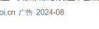
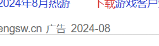

try:

# 搜索 #
1. 使用关键词
2. 修饰符：" A "不会出现有关A的结果
3. -（减号）：-A：A不会出现在搜索结果中
4. OR, | ：表示满足两个关键词中的一个即会出现在搜索结果中
5. 限定网站搜索(site: )，使用 site: 后接网站域名的格式，限定只对特定网站进行搜索
6. 限定标题搜索(intitle: ,allintitle: )，intitle: 关键词后接关键字，表示要搜索的关键字只会在标题中出现。
7. 限定正文搜索(intext: )，通常与 intitle: 结合使用，表示关键词应该在正文中出现
8. 文件类型搜索(filetype: )，filetype: 后面接文件类型，可以直接搜索文件而非网页。
   