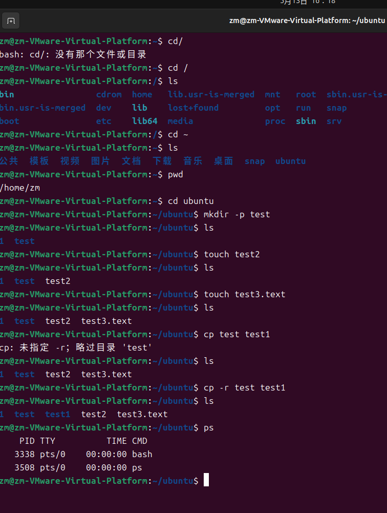
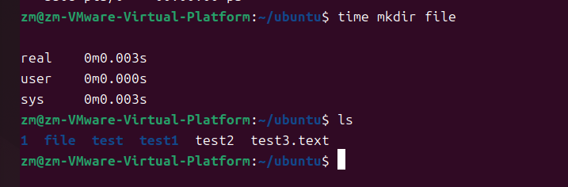

# 基本命令 #
- 常用命令
  ```plain
  cd [dirName]
  ```
  cd /:根目录   
  cd ~：当前目录的home目录   
  cd ..：当前目录的上一层目录    
  cd ./:当前目录
  **展示当前目录下的所有文件**
  ```shell
  dir [options] [Directory] [Files]    
   ls [options] [Directory]  
   ```
**ls的用法**
```shell
ls -l           # 以长格式显示当前目录中的文件和目录
ls -a           # 显示当前目录中的所有文件和目录，包括隐藏文件
ls -lh          # 以人类可读的方式显示当前目录中的文件和目录大小
ls -t           # 按照修改时间排序显示当前目录中的文件和目录
ls -R           # 递归显示当前目录中的所有文件和子目录
ls -l /etc/passwd     # 显示/etc/passwd文件的详细信息
```
**pwd**(显示当前的目录)
```plain
pwd [--help] [--version]
```
**mkdir**
```plain
mkdir [-p] dirName
```
-p 确保目录名称存在，不存在的就建一个。
在当前目录下新建文件夹，后面的 dirName 可以是个目录下的文件夹（即 dir1/dir2 的形式表示在当前目录的 dir1 文件夹下建立它的子文件夹 dir2）。如果加入 -p 选项会一直沿着 dirName 指定的目录建立（即若不存在 dir1 则先建立 dir1 直到指定位置），不加入 -p 若目录不存在则会报错。
**touch**
touch 文件名（在当前目录下创建文件）
touch [-acfm][-d<日期时间>][-r<参考文件或目录>][-t<日期时间>][--help][--version] [文件或目录]
**cp**
```shell
cp [options] source dest
```
前者表示源文件，后者表示目标文件，表示将指定源文件复制到目标文件位置。若目标文件不存在则会新建一个（此时作用相当于备份），若目标文件存在则会替换（此时相当于替换）
```plain
-a：此选项通常在复制目录时使用，它保留链接、文件属性，并复制目录下的所有内容。其作用等于 dpR 参数组合。
-d：复制时保留链接。这里所说的链接相当于 Windows 系统中的快捷方式。
-r 或 --recursive：用于复制目录及其所有的子目录和文件，如果要复制目录，需要使用该选项。
-i 或 --interactive：在复制前提示确认，如果目标文件已存在，则会询问是否覆盖，回答 y 时目标文件将被覆盖。。
-u 或 --update：仅复制源文件中更新时间较新的文件。
-v 或 --verbose：显示详细的复制过程。
-p 或 --preserve：保留源文件的权限、所有者和时间戳信息。
-f 或 --force：强制复制，即使目标文件已存在也会覆盖，而且不给出提示。
-l：不复制文件，只是生成链接文件。
```
**mv**
```plain
mv [options] source dest
```
前者表示源文件，后者表示目标文件，表示将指定源文件移动到目标文件位置。
```plain
-b: 当目标文件或目录存在时，在执行覆盖前，会为其创建一个备份。
-i: 如果指定移动的源目录或文件与目标的目录或文件同名，则会先询问是否覆盖旧文件，输入 y 表示直接覆盖，输入 n 表示取消该操作。
-f: 如果指定移动的源目录或文件与目标的目录或文件同名，不会询问，直接覆盖旧文件。
-n: 不要覆盖任何已存在的文件或目录。
-u：当源文件比目标文件新或者目标文件不存在时，才执行移动操作。
```
**ps**
```plain
ps [options] [--help]
```
用于显示当前进程的状态，类似于 Windows 的任务管理器
```plain
--help 查看帮助
-A 列出所有的进程
-au 显示较详细的资讯
-aux 显示所有包含其他使用者的进程
```
查找指定进程
ps -ef | grep 进程关键字
**try**

**解压缩**
1. .tar:
解包：tar -xvf FileName.tar    
打包：tar -cvf FileName.tar DirName    
2. .gz:
解压1：gunzip FileName.gz   
解压2：gzip -d FileName.gz    
压缩：gzip FileName    
3. .tar.gz 和 .tgz:
解压：tar -zxvf FileName.tar.gz      
压缩：tar -zcvf FileName.tar.gz DirName    
4. .bz2:
解压1：bzip2 -d FileName.bz2     
解压2：bunzip2 FileName.bz2   
压缩： bzip2 -z FileName   
5. .tar.bz2:
解压：tar -jxvf FileName.tar.bz2    
压缩：tar -jcvf FileName.tar.bz2 DirName    
6. .zip:
解压：unzip FileName.zip    
压缩：zip FileName.zip DirName    
7. .rar:
解压：rar -x FileName.rar   
压缩：rar -a FileName.rar DirName   
**其他命令**
sudo COMMAND      
time COMMAND（完成命令后返回运行时间）
COMMAND < file 表示将指定文件作为执行命令中的输入   
COMMAND > file 表示将命令输出至指定文件而非终端  
表示将命令输出至指定文件而非终端，二者可以连用，比如：./a.out < test.in > test.out 表示将 test.in 作为程序的读入，test.out 作为程序的输出。
**try**

**vim**
vi/vim 分为三种模式：命令模式（普通模式）、输入模式、命令行模式（底线命令模式）
1. 直接在命令行输入 vi / vim 则会进入命令模式，以下是几个常用命令：
   vim +命令
```plain
i  -- 切换到输入模式，在光标当前位置开始输入文本。    
x  -- 删除当前光标所在处的字符。   
:  -- 切换到底线命令模式，以在最底一行输入命令。  
dd -- 剪切当前行。   
yy -- 复制当前行。  
p  -- 粘贴剪贴板内容到光标下方。   
P  -- 粘贴剪贴板内容到光标上方。   
u  -- 撤销上一次操作。  
Ctrl+r -- 重做上一次撤销的操作。  
```
**方法**
1. 先输入vim进入命令模式
2. 在输入`i`切换到输入模式
3. 若要用其他命令可以按**Esc**，之后就可以用x，：，dd，yy等命令了
4. 按Esc后输入`:`则可以进入底线命令模式
```plain
:w  -- 保存文件。   
:q  -- 退出 Vim 编辑器。   
:wq -- 保存修改并退出 Vim 编辑器。  
:q! -- 不保存修改强制退出 Vim 编辑器。  
```
*vim教程软件*
vimtutor
**我用的Ubuntu24.04.2**
VMware tools 的安装已经安装好了，但是只能复制文件，不能复制文件夹